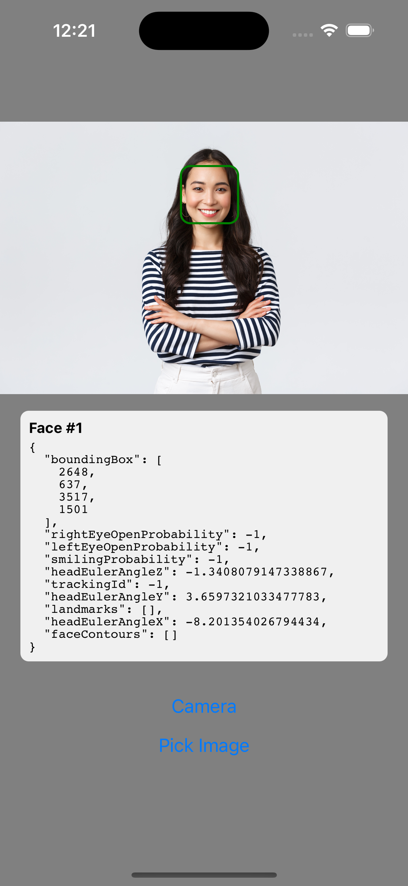

A React Native application that demonstrates real-time face detection capabilities using the device's camera or photo library.

## Features

- 📸 Take photos using the device camera
- 🖼️ Select images from the photo library
- 👤 Real-time face detection
- 📐 Face bounding box visualization
- 📱 Cross-platform (iOS & Android)

## Demo

Below is a screenshot showing the package's expected behavior. The app detects faces in a selected or captured image and draws a bounding box around the detected face(s), along with face data:

<div align="center">
  
</div>

## Prerequisites

- Node.js (v14 or newer)
- Xcode (for iOS development)
- Android Studio (for Android development)
- React Native development environment set up

## Permissions

This package requires camera and photo library permissions to function correctly.

### iOS

Add the following keys to your `Info.plist`:

```xml
<key>NSCameraUsageDescription</key>
<string>We need access to your camera to take photos.</string>
<key>NSPhotoLibraryUsageDescription</key>
<string>We need access to your photo library to select images.</string>
```

### Android

Add the following permissions to your `AndroidManifest.xml`:

```xml
<uses-permission android:name="android.permission.CAMERA" />
<uses-permission android:name="android.permission.READ_EXTERNAL_STORAGE" />
<uses-permission android:name="android.permission.WRITE_EXTERNAL_STORAGE" />
```

For Android 13+ (API 33+), also add:

```xml
<uses-permission android:name="android.permission.READ_MEDIA_IMAGES" />
```

## Compatibility

This package has been tested with the following versions:

- react: 19.1.0
- react-native: 0.80.1
- react-native-face-detection: ^0.1.1
- react-native-image-picker: ^8.2.1

It may work with other versions, but these are the versions officially tested and supported.

## Installation

Install the package and its peer dependencies:

```sh
npm install react-native-face-capture react-native-face-detection react-native-image-picker
# or
yarn add react-native-face-capture react-native-face-detection react-native-image-picker
```

## Usage

Here is a basic example using the FaceDetector component:

```jsx
import React, { useState } from "react";
import { View } from "react-native";
import { FaceDetector, ImagePickerButtons } from "react-native-face-capture";

export default function App() {
  const [image, setImage] = useState();

  return (
    <View style={{ flex: 1 }}>
      <ImagePickerButtons onImagePicked={setImage} />
      <FaceDetector
        image={image}
        onDetection={(faces) => {
          console.log("Detected faces:", faces);
        }}
      />
    </View>
  );
}
```

## API

- `FaceDetector`: Main component for face detection and overlay.
- `useFaceDetection`: Custom hook for face detection logic.
- `FaceOverlay`: Overlay component for drawing on faces.
- `ImagePickerButtons`: UI for picking images from the camera or gallery.

## License

MIT
